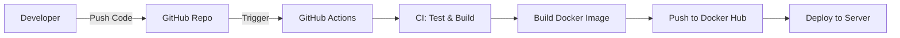

# Kế hoạch Triển khai CI/CD (Senior DevOps Architecture)

Chào bạn, đây là bản kế hoạch chi tiết để đưa hệ thống Microservices của chúng ta lên quy trình tự động hóa hoàn toàn (CI/CD) sử dụng **GitHub Actions**. Tôi sẽ giải thích tỉ mỉ từng giai đoạn và ý nghĩa của các lệnh để bạn nắm bắt được tư duy vận hành (Operations).

---

## 1. Điều kiện cần để triển khai CI/CD (Prerequisites)

Để hệ thống này vận hành trơn tru, một "Senior" sẽ luôn chuẩn bị kỹ các yếu tố sau:

### 1.1 Hạ tầng Mã nguồn & Registry
- **GitHub Repository**: Nơi lưu trữ code của toàn bộ microservices.
- **Docker Hub / GitHub Packages**: Registry để lưu trữ các "khuôn mẫu" (Images) sau khi build. Bạn cần tạo account và lấy **Access Token**.

### 1.2 Hạ tầng Server (Target Server)
- **Linux Server (Ubuntu/CentOS)**: Khuyên dùng VPS/Cloud có ít nhất 4GB RAM trở lên.
- **Docker & Docker Compose**: Đã được cài đặt sẵn trên Server.
- **SSH Access**: Server phải mở port 22 và cho phép truy cập bằng Private Key (tránh dùng mật khẩu để bảo mật).

### 1.3 Quản lý Tài liệu & Biến môi trường (Secrets)
- Các file cấu hình nhạy cảm (`.env`, `application-prod.yml`) **TUYỆT ĐỐI** không push lên GitHub. Chúng ta sẽ cấu hình chúng trực tiếp trên Server hoặc sử dụng **GitHub Secrets**.

### 1.4 Lựa chọn hạ tầng: VM (Máy ảo local) hay VPS (Cloud)?
Đây là thắc mắc rất phổ biến. Theo kinh nghiệm của tôi:
- **Dùng VM (Máy ảo của bạn)**: Rất tốt để **Học và Test**. Bạn không tốn phí, có toàn quyền kiểm soát. 
  - *Vấn đề*: GitHub Actions (Cloud) không thể SSH vào máy ảo của bạn vì nó nằm sau router (NAT).
  - *Giải pháp Senior*: Sử dụng **GitHub Self-hosted Runner**. Bạn cài một phần mềm nhỏ của GitHub lên máy ảo, nó sẽ chủ động kết nối lên GitHub để nhận lệnh build/deploy. Đây là cách tốt nhất để triển khai CI/CD trên máy cá nhân mà không cần IP Public.
- **Dùng VPS (Cloud)**: Cần thiết cho **Dự án thực tế**. Hệ thống luôn online, GitHub Actions kết nối trực tiếp qua SSH một cách dễ dàng.

---

## 2. Tổng Quan Mô Hình CI/CD

Chúng ta sẽ xây dựng một Pipeline (đường ống) gồm 3 giai đoạn chính:

1.  **Continuous Integration (CI)**: Tự động Kiểm tra & Build code.
2.  **Containerization**: Tự động đóng gói Docker Image & Đẩy lên Registry.
3.  **Continuous Deployment (CD)**: Tự động cập nhật hệ thống trên Server.



---

## 2. Chi Tiết Pipeline & Giải Thích Lệnh

Dưới đây là mô phỏng cấu trúc file `.github/workflows/main.yml` và giải thích từng phần:

### Giai đoạn 1: Khởi tạo (Setting up)
```yaml
name: Microservices CI/CD Pipeline
on:
  push:
    branches: [ main ] # Kích hoạt pipeline khi code được push vào nhánh main
```
*   **Giải thích**: Rule này giúp bảo vệ môi trường Production. Chỉ khi code đã qua review và merge vào `main` thì quy trình deploy mới bắt đầu.

### Giai đoạn 2: CI - Java Build & Test
```yaml
jobs:
  build-and-test:
    runs-on: ubuntu-latest
    steps:
      - uses: actions/checkout@v4 # 1. Lấy source code từ repo về môi trường build
      
      - name: Set up JDK 21
        uses: actions/setup-java@v4 # 2. Cài đặt Java 21 LTS
        with:
          java-version: '21'
          distribution: 'temurin'
          cache: 'maven' # 3. Cấu hình Cache Maven - Cực kỳ quan trọng để build nhanh hơn
          
      - name: Build with Maven
        run: mvn clean package -DskipTests # 4. Build thử nghiệm xem code có lỗi compile không
```
*   **Senior Note**: Việc dùng `cache: 'maven'` sẽ giúp GitHub lưu lại các thư viện `.m2`. Lần chạy sau sẽ không phải tải lại toàn bộ, tiết kiệm 50-70% thời gian build.

### Giai đoạn 3: Docker Build & Push
```yaml
  docker-push:
    needs: build-and-test # Chỉ chạy khi bước CI thành công
    steps:
      - name: Login to Docker Hub
        uses: docker/login-action@v3 # 5. Đăng nhập vào Docker Hub bằng Secrets
        with:
          username: ${{ secrets.DOCKERHUB_USERNAME }}
          password: ${{ secrets.DOCKERHUB_TOKEN }}
          
      - name: Build and Push Order Service
        uses: docker/build-push-action@v5 # 6. Tự động Build & Push image
        with:
          context: .
          file: order-service/Dockerfile
          push: true
          tags: user/order-service:latest
```
*   **Giải thích**: `secrets.DOCKERHUB_TOKEN` là biến môi trường bảo mật. Chúng ta không bao giờ hardcode mật khẩu vào file yaml.

### Giai đoạn 4: CD - Deployment (Triển khai)
```yaml
  deploy:
    needs: docker-push
    runs-on: ubuntu-latest
    steps:
      - name: Deploy via SSH
        uses: appleboy/ssh-action@master # 7. Kết nối SSH vào Server của bạn
        with:
          host: ${{ secrets.SERVER_HOST }}
          username: ${{ secrets.SERVER_USER }}
          key: ${{ secrets.SSH_PRIVATE_KEY }}
          script: |
            cd /app/microservice
            docker-compose pull # 8. Tải image mới nhất về
            docker-compose up -d # 9. Cập nhật container mà không làm gián đoạn hệ thống
```
*   **Giải thích**: Lệnh `docker-compose pull` sẽ kéo image `:latest` mà chúng ta vừa push ở bước 3, sau đó `up -d` sẽ restart container với phiên bản mới nhất.

---

## 3. Các bước bạn cần chuẩn bị (Cấu hình một lần)

Để kế hoạch này chạy được, bạn cần chuẩn bị 4 thứ sau trên GitHub:

1.  **DOCKERHUB_USERNAME / TOKEN**: Để Action được phép đẩy image lên account của bạn.
2.  **SERVER_HOST / USER**: Địa chỉ IP và User của Server thật.
3.  **SSH_PRIVATE_KEY**: Để GitHub có quyền "mở cửa" vào Server deploy mà không cần mật khẩu.

---

## 4. Tại sao đây là mẫu thiết kế "Senior"?

1.  **Fail-Fast**: Nếu bước `build-and-test` lỗi, pipeline sẽ dừng ngay lập tức, không cho phép đẩy code lỗi lên production.
2.  **Idempotency**: Quy trình deploy được thiết kế để dù chạy lại nhiều lần cũng không gây lỗi hệ thống.
3.  **Security**: Toàn bộ thông tin nhạy cảm đều được mã hóa bằng **GitHub Secrets**.
4.  **Traceability**: Mỗi bản deploy đều gắn với một commit ID, giúp bạn biết chính xác ai đã deploy cái gì và khi nào.

> [!TIP]
> **Lời khuyên**: Hãy bắt đầu với việc tự động hóa (CI) cho code trước, sau đó mới đến tự động hóa đóng gói (Docker), và cuối cùng mới là tự động deploy. Đừng làm tất cả cùng lúc để dễ debug!

Bạn thấy kế hoạch này thế nào? Nếu bạn đồng ý, tôi sẽ tạo thư mục cấu hình `.github/workflows` và bắt đầu viết file CI mẫu cho service đầu tiên.
