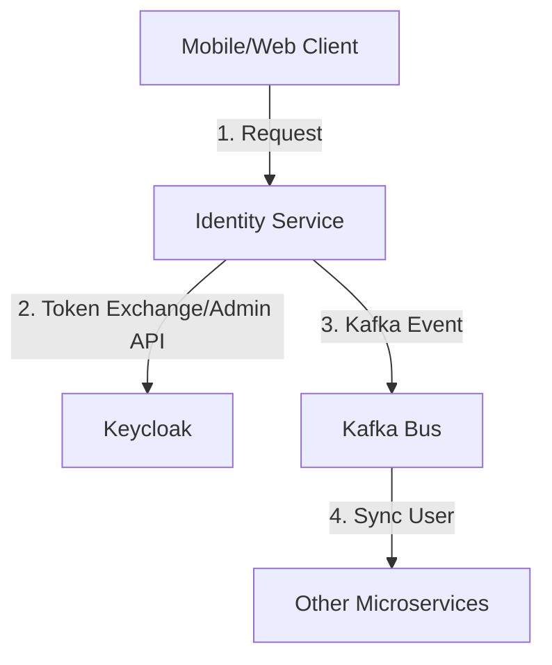

# Tài Liệu Phân Tích Luồng Xử Lý (Identity Flow Architecture)

Chào bạn, đây là tài liệu "Senior Walkthrough" giải thích chi tiết luồng dữ liệu của hệ thống Identity mà chúng ta vừa xây dựng. Tài liệu này được biên soạn theo phong cách official documentation của Spring.

---

## 1. Tổng Quan Kiến Trúc (High-Level Architecture)

Chúng ta xây dựng `identity-service` theo mô hình **Authentication Facade**. Nghĩa là Service này đóng vai trò là "mặt tiền" duy nhất cho Client, che giấu sự phức tạp của Keycloak bên sau.

---

## 2. Luồng Đăng Nhập (Authentication Flow - Login)

Đây là luồng "Direct Grant" giúp Client lấy Token mà không cần dùng giao diện mặc định của Keycloak.

1.  **IdentityController**: Nhận `LoginRequest` (username/password).
2.  **IdentityService.login()**:
    *   Tạo một POST request thủ công (dùng `RestTemplate`) tới endpoint `/protocol/openid-connect/token` của Keycloak.
    *   **Tại sao dùng RestTemplate?** Vì Keycloak Admin Client mặc định không hỗ trợ tốt việc "Login hộ" User. Dùng API trực tiếp giúp chúng ta kiểm soát tốt Header, Client Secret và xử lý lỗi linh hoạt.
3.  **Keycloak Output**: Trả về `AccessTokenResponse` chứa JWT.
4.  **Mapped Response**: `IdentityService` ánh xạ token này về `AuthResponse` để trả về cho Client.

---

## 3. Luồng Bảo Mật JWT (Security Flow - Authorization)

Khi một request yêu cầu bảo mật (ví dụ: `/profile`) đi vào hệ thống, luồng xử lý như sau:

1.  **SecurityFilterChain (Spring Security)**:
    *   Yêu cầu request phải có Header `Authorization: Bearer <JWT>`.
    *   **OAuth2 Resource Server**: Tự động lấy Public Key của Keycloak để kiểm tra chữ ký của JWT (đảm bảo token không bị giả mạo).
2.  **JwtAuthenticationConverter (Trái tim của RBAC)**:
    *   Spring Security mặc định không biết đọc "Role" của Keycloak (vì Keycloak lưu role trong object `realm_access`).
    *   Hàm này nhảy vào, móc tách danh sách roles từ JSON của JWT.
    *   Thêm tiền tố `ROLE_` (ví dụ: `ADMIN` -> `ROLE_ADMIN`).
3.  **SecurityContextHolder**: Sau khi chuyển đổi thành công, thông tin User và các Role được đưa vào "Context" của Spring.
4.  **@PreAuthorize**: Tại Controller, Spring sẽ check xem Role trong Context có khớp với yêu cầu hay không.

---

## 4. Luồng Đăng Ký & Đồng Bộ (Registration & Sync Flow)

Đây là luồng đảm bảo tính nhất quán dữ liệu trong Microservices.

1.  **registerUser()**:
    *   Dùng **Admin Client** để tạo User trên Keycloak.
    *   **Gán Role mặc định**: Ngay sau khi tạo, gọi thêm 1 API để gán role `USER`.
2.  **Kafka Integration**:
    *   Tạo User thành công -> Bắn `UserCreatedEvent` sang Kafka.
    *   **Lý do**: Để các service khác (như `order`, `payment`) biết được User mới này mà khởi tạo các dữ liệu liên quan (ví dụ: Ví tiền, Giỏ hàng) mà không cần gọi ngược lại `identity-service`.

---

## 5. Quy Tắc "Vàng" Khi Đọc Code Identity

*   **Controller**: Chỉ làm nhiệm vụ điều hướng (Routing) và xác thực dữ liệu đầu vào (`@Valid`).
*   **Service**: Chứa logic "Nghiệp vụ định danh" (giao tiếp với Keycloak).
*   **Config**: Chứa logic "Hệ thống" (Cấu hình Filter, JWT, Roles).
*   **Principal**: Luôn dùng đối tượng này trong Controller để lấy thông tin User hiện tại, tránh việc truyền ID từ Client lên (vì Client có thể truyền ID giả).

---

Hy vọng tài liệu này giúp bạn hình dung rõ ràng "mạch máu" của hệ thống bảo mật chúng ta đang xây dựng. Đọc nó xong, bạn sẽ thấy Spring Security không hề khó, nó chỉ là một chuỗi các "máy lọc" (Filters) hoạt động nhịp nhàng với nhau!
